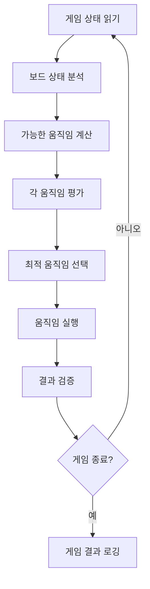

# 2048 게임 AI 어시스턴스 파이프라인 설계문서

## 1. 개요

2048 게임의 최단시간 클리어를 위한 AI 어시스턴스 시스템의 아키텍처 설계문서입니다. Clean Architecture와 SOLID 원칙을 기반으로 하여 테스트 가능하고 확장 가능한 구조로 설계되었습니다.

## 2. 시스템 아키텍처

### 2.1 전체 구조 (Clean Architecture)

```
┌─────────────────────────────────────────────────────────────┐
│                   Presentation Layer                        │
│  ┌─────────────────┐  ┌─────────────────┐  ┌──────────────┐ │
│  │   Web Browser   │  │   Game Monitor  │  │   Logging    │ │
│  │   Controller    │  │   Dashboard     │  │   Interface  │ │
│  └─────────────────┘  └─────────────────┘  └──────────────┘ │
└─────────────────────────────────────────────────────────────┘
                              │
┌─────────────────────────────────────────────────────────────┐
│                  Application Layer                          │
│  ┌─────────────────┐  ┌─────────────────┐  ┌──────────────┐ │
│  │   Game Service  │  │ Decision Engine │  │  Automation  │ │
│  │                 │  │     Service     │  │   Service    │ │
│  └─────────────────┘  └─────────────────┘  └──────────────┘ │
└─────────────────────────────────────────────────────────────┘
                              │
┌─────────────────────────────────────────────────────────────┐
│                    Domain Layer                             │
│  ┌─────────────────┐  ┌─────────────────┐  ┌──────────────┐ │
│  │   Game Board    │  │  Move Strategy  │  │   Game       │ │
│  │     Model       │  │    Algorithm    │  │   Rules      │ │
│  └─────────────────┘  └─────────────────┘  └──────────────┘ │
└─────────────────────────────────────────────────────────────┘
                              │
┌─────────────────────────────────────────────────────────────┐
│                Infrastructure Layer                         │
│  ┌─────────────────┐  ┌─────────────────┐  ┌──────────────┐ │
│  │   Web Driver    │  │   Pattern       │  │   Config     │ │
│  │   Repository    │  │   Cache Store   │  │  Repository  │ │
│  └─────────────────┘  └─────────────────┘  └──────────────┘ │
└─────────────────────────────────────────────────────────────┘
```

## 3. 핵심 컴포넌트 설계

### 3.1 Domain Layer

#### GameBoard (도메인 모델)
```typescript
interface GameBoard {
  readonly cells: number[][];
  readonly score: number;
  readonly isGameOver: boolean;
  readonly hasWon: boolean;
  
  move(direction: Direction): GameBoard;
  canMove(direction: Direction): boolean;
  getEmptyCells(): Position[];
  getMaxTile(): number;
}
```

#### MoveStrategy (전략 패턴)
```typescript
interface MoveStrategy {
  calculateBestMove(board: GameBoard): Direction;
  evaluateBoard(board: GameBoard): number;
}

class ExpectimaxStrategy implements MoveStrategy
class MinimaxStrategy implements MoveStrategy
class MonotonicityStrategy implements MoveStrategy
```

#### GameRules (비즈니스 규칙)
```typescript
class GameRules {
  static readonly TARGET_TILE = 2048;
  static readonly NEW_TILE_VALUES = [2, 4];
  static readonly BOARD_SIZE = 4;
  
  validateMove(board: GameBoard, direction: Direction): boolean;
  calculateScore(mergedTiles: number[]): number;
  isVictoryCondition(board: GameBoard): boolean;
}
```

### 3.2 Application Layer

#### GameService (게임 상태 관리)
```typescript
class GameService {
  constructor(
    private gameRepository: GameRepository,
    private moveStrategy: MoveStrategy
  ) {}
  
  async getCurrentGameState(): Promise<GameBoard>;
  async executeOptimalMove(): Promise<MoveResult>;
  async analyzeGameState(): Promise<GameAnalysis>;
}
```

#### DecisionEngineService (의사결정 엔진)
```typescript
class DecisionEngineService {
  constructor(
    private strategies: MoveStrategy[],
    private evaluator: BoardEvaluator
  ) {}
  
  async calculateOptimalMove(board: GameBoard): Promise<DecisionResult>;
  async simulateMovesAhead(board: GameBoard, depth: number): Promise<Simulation>;
}
```

### 3.3 Infrastructure Layer

#### WebDriverRepository (게임 상태 읽기)
```typescript
class WebDriverRepository implements GameRepository {
  constructor(private driver: WebDriver) {}
  
  async readCurrentBoard(): Promise<GameBoard>;
  async executeMove(direction: Direction): Promise<void>;
  async isGameActive(): Promise<boolean>;
}
```

#### PatternCacheStore (패턴 캐싱)
```typescript
class PatternCacheStore {
  private cache: Map<string, EvaluationResult>;
  
  async getPattern(boardHash: string): Promise<EvaluationResult | null>;
  async savePattern(boardHash: string, result: EvaluationResult): Promise<void>;
}
```

## 4. 알고리즘 파이프라인

### 4.1 실행 흐름



### 4.2 평가 함수 구성요소

#### 단조성 평가 (Monotonicity)
- 보드의 타일이 한 방향으로 정렬된 정도 측정
- 가중치: 40%

#### 빈 공간 평가 (Smoothness)
- 인접한 타일 간의 값 차이 최소화
- 가중치: 20%

#### 최대값 위치 평가 (Max Position)
- 최대값이 코너에 위치하는지 확인
- 가중치: 25%

#### 빈 셀 개수 평가 (Empty Cells)
- 사용 가능한 빈 공간의 개수
- 가중치: 15%

## 5. 성능 최적화 전략

### 5.1 알고리즘 최적화
- **Alpha-Beta 가지치기**: 불필요한 탐색 경로 제거
- **대칭성 활용**: 보드의 대칭 상태 중복 계산 방지
- **깊이 제한**: 계산 시간과 정확도의 균형

### 5.2 캐싱 전략
- **보드 상태 해시**: 동일한 보드 상태의 중복 계산 방지
- **패턴 테이블**: 자주 나타나는 패턴의 사전 계산 결과 저장
- **LRU 캐시**: 메모리 효율적인 캐시 관리

### 5.3 병렬 처리
- **멀티스레딩**: 각 가능한 움직임을 병렬로 평가
- **워커 풀**: 계산 집약적인 작업의 분산 처리

## 6. 테스트 전략

### 6.1 단위 테스트
```typescript
describe('GameBoard', () => {
  test('should merge tiles correctly', () => {
    // Given
    const board = new GameBoard([[2, 2, 0, 0], ...]);
    
    // When
    const result = board.move(Direction.LEFT);
    
    // Then
    expect(result.cells[0][0]).toBe(4);
  });
});
```

### 6.2 통합 테스트
- 전체 파이프라인의 end-to-end 테스트
- 실제 게임 시나리오 시뮬레이션
- 성능 벤치마크 테스트

### 6.3 테스트 더블
- **Mock WebDriver**: 브라우저 없이 테스트 실행
- **Stub GameRepository**: 예측 가능한 게임 상태 제공
- **Spy Logger**: 로깅 동작 검증

## 7. 모니터링 및 로깅

### 7.1 메트릭 수집
- 게임 완료 시간
- 평균 이동 횟수
- 목표 달성률 (2048 달성)
- 알고리즘별 성능 비교

### 7.2 로깅 전략
```typescript
interface GameLog {
  timestamp: Date;
  boardState: GameBoard;
  selectedMove: Direction;
  evaluationScore: number;
  executionTime: number;
}
```

### 7.3 대시보드 구성
- 실시간 게임 진행 상황
- 성능 통계 (시간, 이동 횟수)
- 알고리즘 효율성 분석
- 오류 발생 현황

## 8. 배포 및 운영

### 8.1 환경 구성
- **개발 환경**: 로컬 테스트 및 디버깅
- **스테이징 환경**: 통합 테스트 및 성능 검증
- **프로덕션 환경**: 실제 게임 실행

### 8.2 CI/CD 파이프라인
```yaml
# 예시 GitHub Actions
name: 2048-AI-Pipeline
on: [push, pull_request]
jobs:
  test:
    runs-on: ubuntu-latest
    steps:
      - uses: actions/checkout@v2
      - name: Run Unit Tests
        run: npm test
      - name: Run Integration Tests
        run: npm run test:integration
      - name: Performance Benchmark
        run: npm run benchmark
```

## 9. 확장 가능성

### 9.1 다양한 전략 추가
- 새로운 `MoveStrategy` 구현체 추가
- A/B 테스트를 통한 전략 성능 비교
- 머신러닝 기반 전략 도입

### 9.2 다른 게임 지원
- 인터페이스 추상화를 통한 다른 퍼즐 게임 지원
- 게임별 특화된 전략 모듈 개발

### 9.3 실시간 학습
- 게임 결과 데이터 수집
- 강화학습을 통한 전략 개선
- 사용자별 맞춤형 전략 제공

## 10. 보안 및 윤리적 고려사항

### 10.1 게임 무결성
- 게임 규칙 준수 확인
- 외부 개입 방지
- 공정한 플레이 보장

### 10.2 사용자 프라이버시
- 개인정보 수집 최소화
- 게임 데이터 익명화
- 로컬 데이터 처리 우선

이 설계문서는 Clean Architecture와 SOLID 원칙을 기반으로 하여 테스트 가능하고 확장 가능한 2048 게임 AI 어시스턴스 시스템의 구조를 제시합니다.